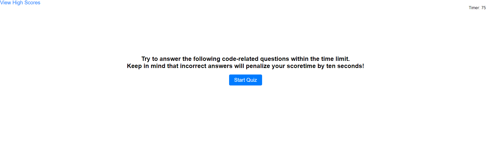

# coding-quiz
https://romeocd.github.io/coding-quiz/

## Description

The coding quiz was created to take a timed quiz on JavaScript fundamentals that stores high scores. The app runs in the browser, and will feature dynamically updated HTML and CSS powered by JavaScript
## Usage

When the coding quiz is opened, there is a start button that when clicked, questions are presented and timer starts to countdown.
Upon answering a question, incorrect questions will subtract time from the clock and then the other questions are presented.
When all questions are answered or timer is at 0, the game is over. 
When the game is over, you can save your initials and score.

## Screenshot
